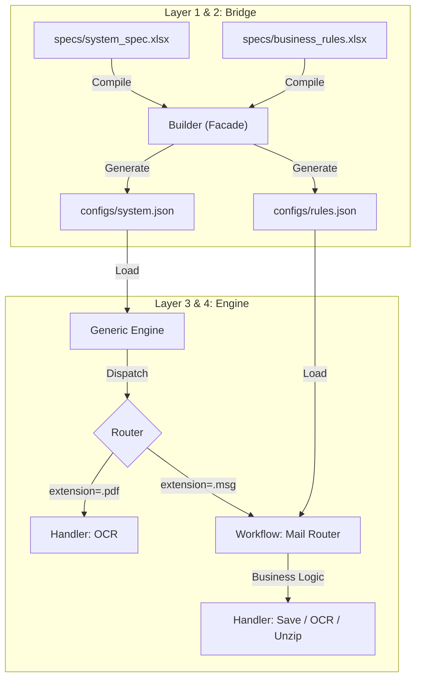

# Pseudo Semantic Bridge (PSB)

**A Metadata-Driven Architecture for Decoupling Business Intent from System Implementation.**


## 📖 Overview

**Pseudo Semantic Bridge (PSB)** is a framework designed to solve the "tight coupling" problem in automation pipelines.

In traditional ETL/Automation, business logic is often hard-coded. PSB introduces a **Metadata-Driven Layer** that acts as a "Bridge". Users define rules in **Excel** (Intent), which are compiled into strict **JSON** (Contract), and executed by a generic **Engine** (Mechanism).

### v2.0 Key Concepts

* **Two-Tier Rule System:** Separates "System Pipelines" (File Extension routing) from "Business Logic" (Subject-based task dispatching).
* **Compile-Time Validation:** Excel rules are validated and compiled into JSON *before* runtime, ensuring speed and stability.
* **Workflow Integration:** Complex logic (like mail sorting) is handled by dedicated Workflows that read their own JSON-compiled rule sets.

---

## 🏗 Architecture

The system consists of distinct layers, now enhanced with a **Workflow Layer** for business logic.



---

## 📂 Directory Structure

```text
project_root/
├── main.py                  # [Entrypoint] Runs Builder -> Engine automatically
├── specs/                   # [Input] User Intent (Excel)
│   └── accounting/
│       ├── invoice_bot_v2.xlsx      # System Pipeline (Extension -> Processor)
│       └── mail_business_rules.xlsx # Business Logic (Subject -> Task)
├── configs/                 # [Artifacts] Compiled JSON (Machine Readable)
├── data/                    # [Output] Processed results
└── src/
    ├── bridge/              # Excel Parser & Builder
    ├── engine/              # Generic Dispatcher
    └── catalog/
        ├── workflows/       # Complex Logic (e.g., Mail Routing)
        └── handlers/        # Atomic Actions (OCR, Save, Unzip)

```

---

## 🛠️ Excel Specification Format

To modify behavior, edit the Excel files in `specs/`.

### File 1: System Pipeline (`invoice_bot_v2.xlsx`)

Defines **"Which tool to use for which file type"**.

| Extension | Processor ID | Parameters (JSON) | Note |
| --- | --- | --- | --- |
| `.pdf` | `pdf_to_text_ocr` | `{"lang": "jpn"}` | Direct OCR |
| `.zip` | `unzip_file` | `{"mode": "manual"}` | Unzip w/ password |
| **`.msg`** | **`mail_workflow`** | **`{"rule_file": "./configs/.../mail_business_rules.json"}`** | **Delegate to Workflow** |

### File 2: Business Rules (`mail_business_rules.xlsx`)

Defines **"How to handle specific business tasks"** (used by `mail_workflow`).
Supports defining different actions for different file types within the same task.

| subject_filter | task_name | require_attachment | target_ext | action_id | parameters |
| --- | --- | --- | --- | --- | --- |
| 請求書 | INVOICE | True | **.pdf** | **ocr_process** | `{"lang": "jpn"}` |
| 請求書 | INVOICE | True | **.xlsx** | **save_only** | `{}` |
| 日報 | REPORT | False | * | save_process | `{}` |

---

## 🚀 Usage Workflow

### 1. Install Dependencies

```bash
pip install pandas openpyxl pydantic pywin32

```

### 2. Run the Bot

You only need to run one command. The script handles both **compilation** (Excel -> JSON) and **execution**.

```bash
python main.py

```

**What happens inside:**

1. **Bridge Phase:** Checks `specs/`. If Excel files are found, it compiles them into optimized JSON files in `configs/`.
2. **Engine Phase:** Loads the JSON config and connects to Outlook.
3. **Processing:**
* It fetches emails.
* Passes `.msg` files to `mail_workflow`.
* `mail_workflow` reads the business rules JSON.
* It executes OCR on PDFs and saves Excel files as defined in your rules.


---

## ⚡ Quick Start (Jupyter Notebook)

Open **`sample copy.ipynb`** (or `quick_run.ipynb`) to visualize the flow step-by-step.

* **Step 1:** Create mock Excel specs.
* **Step 2:** Compile them to JSON (observe the `configs/` folder creation).
* **Step 3:** Run the Engine and verify the output in `data/`.