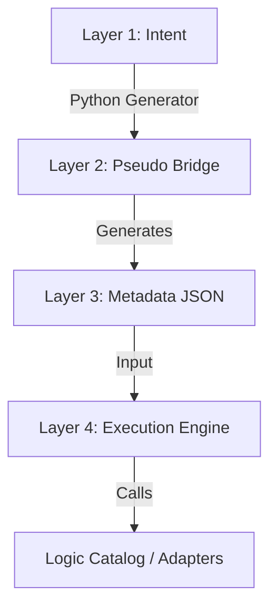

# Pseudo Semantic Bridge (PSB)

**A Metadata-Driven Architecture for Decoupling Business Intent from System Implementation.**

## 📖 Overview

**Pseudo Semantic Bridge (PSB)** is a design pattern and framework developed to solve the "tight coupling" problem in complex automation and ETL pipelines. 

In traditional systems, business logic is hard-coded. When a business rule changes, the code must change. PSB introduces a **Metadata-Driven Layer** that acts as a "Bridge." In Phase 1 (Pseudo), this bridge is built using deterministic Python generators to ensure 100% stability. In Phase 2, this layer can be seamlessly replaced by LLMs (AI) without changing the core execution engine.

### 🚀 Key Concepts

* **Metadata-First:** All execution logic is defined in JSON schemas validated by **Pydantic**.
* **Deterministic Bridge:** We avoid "AI uncertainty" by using Python-based config generators to produce the metadata.
* **Dynamic Dispatch Engine:** A generic runner that executes tasks based on the metadata, decoupled from the underlying business logic.
* **Template Inheritance:** Reduce configuration redundancy by inheriting from base company-wide templates.

---

## 🏗 Architecture

The system consists of four distinct layers:

1.  **Intent (Layer 1):** Human requirements (Excel, Specs, or Natural Language).
2.  **Bridge (Layer 2):** The "Translator." In this repo, it's a **Pseudo-Bridge** using Python scripts to convert Intent into Metadata.
3.  **Metadata (Layer 3):** Strict JSON/Pydantic definitions (The Single Source of Truth).
4.  **Engine (Layer 4):** The Dispatcher that executes logic defined in the **Logic Catalog**.

