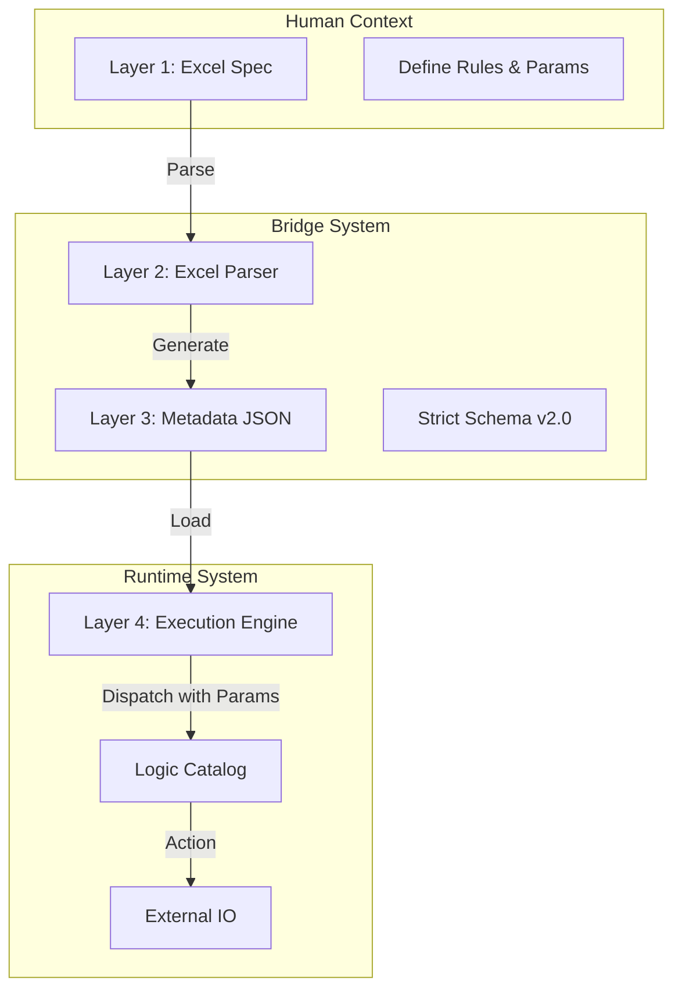

# Pseudo Semantic Bridge (PSB)

**A Metadata-Driven Architecture for Decoupling Business Intent from System Implementation.**


## 📖 Overview

**Pseudo Semantic Bridge (PSB)** is a framework designed to solve the "tight coupling" problem in automation pipelines.

In traditional ETL/Automation, business logic is often hard-coded. PSB introduces a **Metadata-Driven Layer** that acts as a "Bridge". Users define rules in **Excel** (Intent), which are compiled into strict **JSON** (Contract), and executed by a generic **Engine** (Mechanism).

### Key Concepts

* **Metadata-First:** Execution logic is controlled entirely by JSON schemas (validated by Pydantic).
* **Policy Injection (v2.0):** Business policies (e.g., `{"mode": "manual"}`) are injected as parameters from Excel directly to the logic.
* **Layer Separation:** The Engine (Python) does not know the Business Rules; it only knows how to execute the instructions given by the Bridge.

---

## ⚡ Quick Start (Jupyter Notebook)

You can experience the full "Excel → JSON → Engine" cycle immediately using the provided notebook.

1. **Install Dependencies:**
```bash
pip install pandas openpyxl pydantic pywin32

```


2. **Run the Demo:**
Open **`sample copy.ipynb`** (or `quick_run.ipynb`) and execute all cells.
* **Step 1:** It creates a mock Excel file (`specs/quickrun/test_spec.xlsx`).
* **Step 2:** It compiles the Excel into a JSON config (`configs/quickrun/test_config.json`).
* **Step 3:** It launches the Engine.
* *Note: If the demo includes a `.zip` file rule with `mode: manual`, check the console for a password input prompt.*


---

## 🏗 Architecture

The system consists of four distinct layers:

1. **Intent (Layer 1):** Human requirements defined in **Excel**.
2. **Bridge (Layer 2):** A Python Parser that converts Excel into strictly validated Metadata.
3. **Metadata (Layer 3):** JSON Artifacts (The Single Source of Truth).
4. **Engine (Layer 4):** A generic Dispatcher that executes the Logic Catalog.



---

## 📂 Directory Structure

```text
project_root/
├── configs/                 # [Layer 3] Generated JSON artifacts (The Truth)
├── specs/                   # [Layer 1] User input files (Excel)
├── data/                    # [Runtime] Runtime data (Ignored by Git)
├── main.py                  # [Entrypoint] Generic Runner
└── src/
    ├── bridge/              # [Layer 2] Excel Parser & Generator
    ├── schema/              # [Layer 3] Pydantic Definitions
    ├── engine/              # [Layer 4] Generic Dispatcher
    ├── catalog/             # [Layer 4] Logic Components (Pure Functions)
    └── adapter/             # I/O Adapters (Outlook, etc.)

```

---

## 🛠️ Excel Specification Format

To add new rules, edit the Excel file in `specs/`.

### Sheet 1: `Settings`

Basic job configuration.

| Key | Value |
| --- | --- |
| **Job Name** | Invoice_Bot_v1 |
| **Domain** | Accounting |
| **Keywords** | Invoice, Payment |
| **Destination** | ./data/invoices |

### Sheet 2: `Rules`

Defines how to process each file type. **Parameters** can be passed as a JSON string.

| Extension | Processor ID | Parameters (JSON) | Note |
| --- | --- | --- | --- |
| `.pdf` | `pdf_to_text_ocr` | `{"lang": "jpn"}` | OCR Japanese docs |
| `.zip` | `unzip_file` | `{"mode": "manual"}` | Ask user for password |
| `.xlsx` | `save_only` |  | Just save |

---

## 🚀 Usage Workflow (Production)

### 1. Update Rules

Modify `specs/accounting/invoice_bot.xlsx`.

### 2. Compile Bridge

Convert the Excel spec to a JSON configuration file.

```bash
python -m src.bridge.excel_parser

```

### 3. Run Engine

Execute the bot using the generated configuration.

```bash
python main.py configs/accounting/invoice_bot.json

```